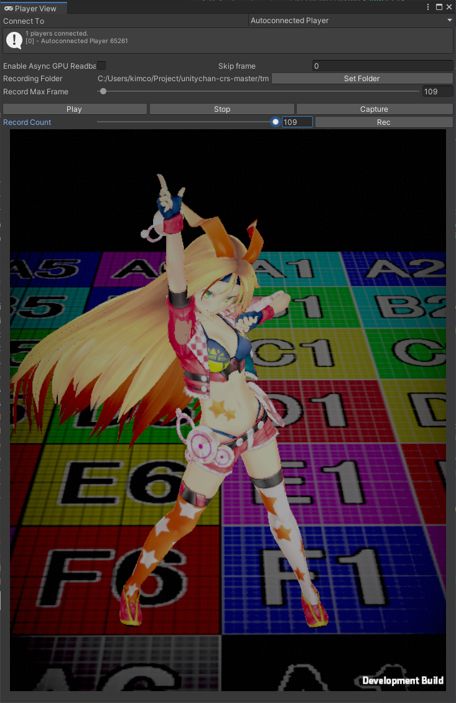
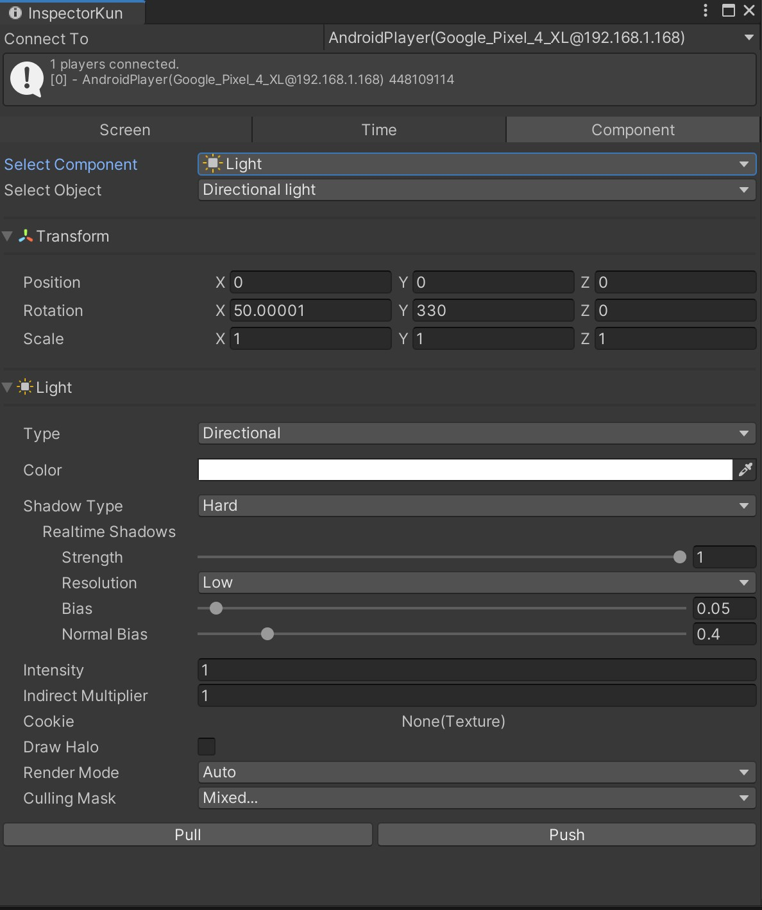
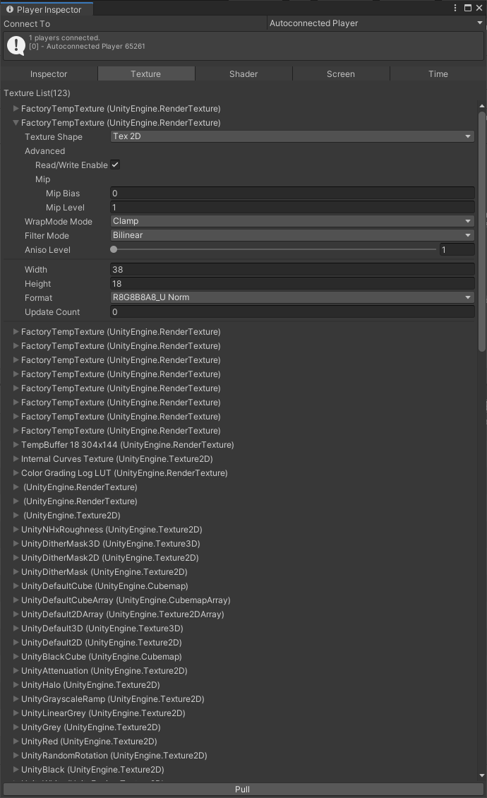
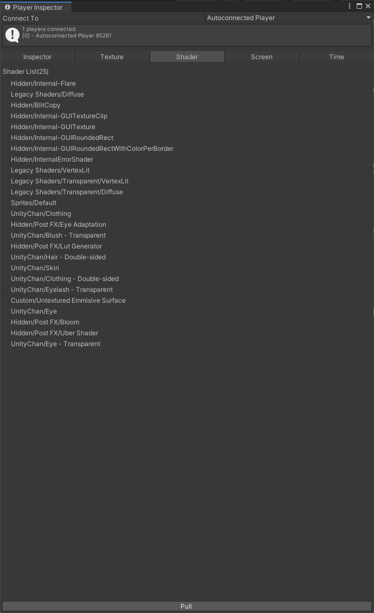
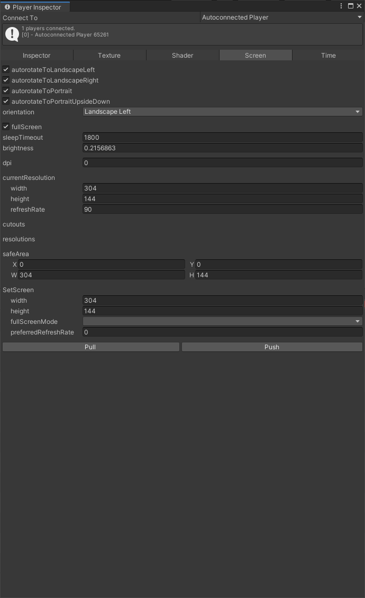
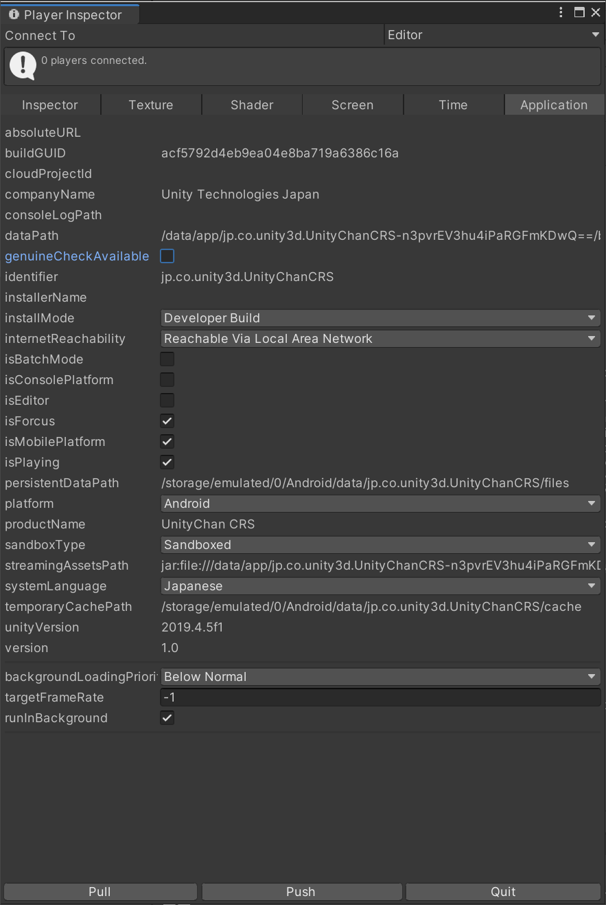
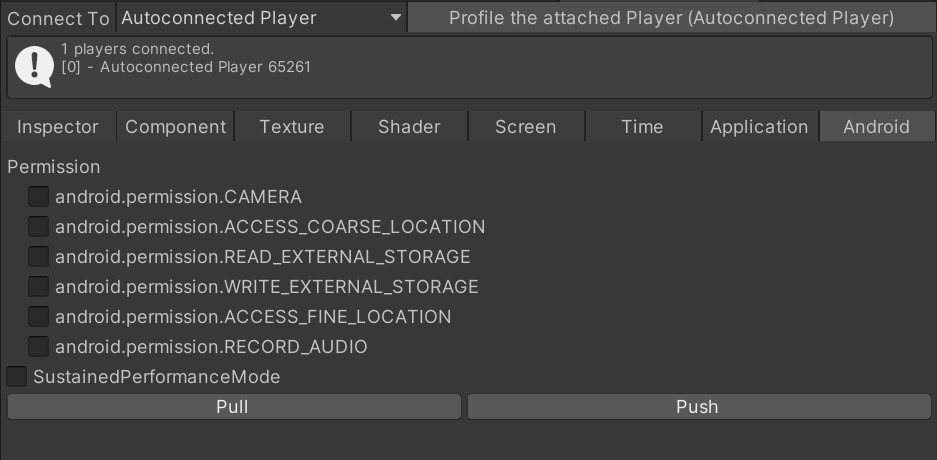
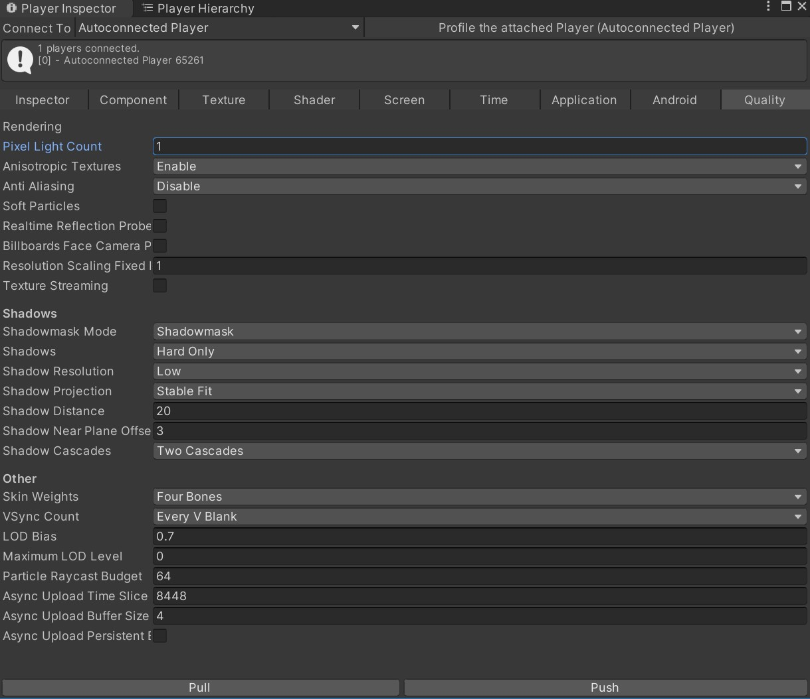

# UnityChoseKun

[English Ver. README](chosekun_en.md)

## はじめに

Unityで開発したアプリを実機上で実行している時に、GameObjectの内容をほんの少しだけ変更したいだけなのに、ビルド完了迄長時間待たされることで、貴重な開発時間を無駄にして悔しい思いをした事は無いでしょうか。
UnityChoseKunは再ビルドを行うこと無く、UnityEditor上で開発機で実行中のアプリの調整を行う為のEditor拡張です。
開発機が物理的に遠い場所にある人向けに実機で時以降中の画面をUnity Editorで表示する機能も保有しています。

## 概要

実機上で実行しているアプリ内の画面をUnityEditorで表示たり、GameObjectをUnityEditorから調整する事が出来る、Editor拡張です。

実機で実行中のアプリ内のComponenを調整したり・・

実機(開発機)の画面をUnityEditorに表示したり・・・

## このプロジェクトで出来ること

本ツールは主に下記の３機能から構成されています。

- 実機で再生されている画面を表示する(Player View)
- 実機で再生されているSceneをHierarchy形式で表示(Player Hierarchy)
- GameObjectに含まれるComponentの内容を編集し実機側へ反映させる。(Player Inspector)

## 動作環境

下記の内容で動作の確認済を行っています。

- Unityのバージョン
  - Unity2018.4.26f1 (一部、機能制限あり)
  - Unity2019.4.11f1
- プラットフォーム
  - Android
    - Pixel3XL
    - Pixel4XL
  - iOS
    - iPhone 6S

## 対応しているClassについて

- [Application](docs.unity3d.com/ja/ScriptReference/Application.html)
- [Screen](https://docs.unity3d.com/ja/ScriptReference/Screen.html)
- [Time](https://docs.unity3d.com/ja/ScriptReference/Time.html)
- [Shader](https://docs.unity3d.com/ja/ScriptReference/Shader.html)
- [Texture](https://docs.unity3d.com/ja/ScriptReference/Texture.html)
- [QualitySettings](https://docs.unity3d.com/ja/ScriptReference/QualitySettings.html)
- [Component](docs.unity3d.com/ja/ScriptReference/Component.html)
  - [Animator](https://docs.unity3d.com/ja/ScriptReference/Animator.html)
  - [Behaviour](https://docs.unity3d.com/ja/current/ScriptReference/Behaviour.html)
  - [Bounds](https://docs.unity3d.com/ja/current/ScriptReference/Bounds.html)
  - [Camera](https://docs.unity3d.com/ja/ScriptReference/Camera.html)
  - [Collider](https://docs.unity3d.com/ja/ScriptReference/Collider.html)
  - [Light](https://docs.unity3d.com/ja/ScriptReference/Light.html)
  - [Material](https://docs.unity3d.com/ja/ScriptReference/Material.html)
  - [Matrix4x4](https://docs.unity3d.com/ja/current/ScriptReference/Matrix4x4.html)
  - [MeshRenderer](https://docs.unity3d.com/ja/ScriptReference/Renderer.html)
  - [MonoBehavior](https://docs.unity3d.com/ja/ScriptReference/MonoBehaviour.html)
  - [Object](https://docs.unity3d.com/ja/current/ScriptReference/Object.html)
  - [Renderer](https://docs.unity3d.com/ja/ScriptReference/Renderer.html)
  - [ParticleSystem](https://docs.unity3d.com/ja/ScriptReference/ParticleSystem.html)
  - [PhysicMaterial](https://docs.unity3d.com/ja/ScriptReference/PhysicMaterial.html)
  - [Quartanion](https://docs.unity3d.com/ja/ScriptReference/Quaternion.html)
  - [Rect](https://docs.unity3d.com/ja/ScriptReference/Rect.html)
  - [Renderer](https://docs.unity3d.com/ja/ScriptReference/Renderer.html)
  - [Resolution](https://docs.unity3d.com/ja/ScriptReference/Resolution.html)
  - [Rigidbody](https://docs.unity3d.com/ja/ScriptReference/Rigidbody.html)
  - [SkinnedMeshRenderer](https://docs.unity3d.com/ja/ScriptReference/SkinnedMeshRenderer.html)
  - [Transform](https://docs.unity3d.com/ja/ScriptReference/Transform.html)
  - [Vector2](https://docs.unity3d.com/ja/ScriptReference/Vector2.html)
  - [Vector3](https://docs.unity3d.com/ja/ScriptReference/Vector3.html)
  - [Vector4](https://docs.unity3d.com/ja/ScriptReference/Vector4.html)

## 注意事項・免責事項

- 万が一*不測の事態が起きても一切保証は出来ませんのでご注意下さい。*
- Script Debuggingと併用できません。必ずScript DebuggingをOFFにした上でビルドを行ってください。
- Player Viewを有効にすると*端末が高温になります。* また、画面解像度に応じてCPUリソースを消費します。PlayerViewの再生を行う前に、Player InspectorのScreenから画面解像度を変更することをお勧めします。Pixel4XLの場合、画面解像度を604x288迄落とした場合、CPUリソースにほぼ消費せずに実行できているようでした。
- Texture,Shaderに関しては内容の確認のみで、変更を行うことは出来ません。
- Materialが参照しているShader/Textureを変更する為にはTexture/ShaderのPullを先に実行する必要があります。
- Unity2018では以下の機能に対応していません。
  - Materialが参照しているTextureの差し替え
  - PlayerViewのAsync GPU Readback機能

## 使い方

本リポジトリの内容を組込み先のUnityProjectのAssetフォルダ以下に丸々配置して下さい。

### アプリケーションビルド時の設定

- 調整を行うSceneに[UnityChoseKun.prefab](https://github.com/katsumasa/UnityChoseKun/blob/master/Player/Prefabs/UnityChoseKun.prefab)を配置してからアプリをビルドする必要があります。
- [Development BuildとAutoconnect Profiler](https://docs.unity3d.com/ja/current/Manual/BuildSettingsStandalone.html)にチェックを入れてる必要があります。
- [Scripting BackEnd](https://docs.unity3d.com/ja/2018.4/Manual/windowsstore-scriptingbackends.html)にはIL2CPPを指定する必要があります。

### 機能紹介

#### PlayerViewer

実機で表示している内容をUnityEditor上で再生するViewerです。

##### 起動方法

MenuからWindow->UnityChoseKun->Player ViewでPlayerView Windowが表示されます。

##### 操作方法

###### Connect To

接続先のデバイスを指定します。接続の仕組みはUnityProfilerと共有していますので、どちらかの接続先を切り替えると、もう片方の接続先も切り替わります。

　再生の開始/終了 
　録画の開始/終了 
　スクリーンショットを保存する 
　録画結果の保存先を指定する 

###### Enable Async GPU Readback

[Async GPU Readback](https://docs.unity3d.com/ja/2018.4/ScriptReference/Rendering.AsyncGPUReadback.html)の機能を使用して画像処理を行う為、MainThareadの負荷が軽減される場合があります。

###### Reflesh Interval

画像の転送処理を行う間隔を指定します。
間隔を開けることでCPU負荷が軽減されます。

###### Record Folde

録画時にファイルを書き出す先のフォルダー

###### Record Count Max

録画に何コマ迄録画するかを指定出来ます。
このコマまで録画を行うと録画は自動的に停止します。

###### Record Count

録画内容をSeekすることが出来ます。

##### 注意事項

Player Viewerは非常に負荷の高い処理です。Player Inspector->Screen->SetScreenからwidthとheightを調整したり、Reflesh Intervalで実行間隔を調整してから再生を実行することを*オススメ*します。

#### Player Hierarchy

  

##### Reload

実機で実行されているアプリケーションのScene情報を分析し、Hierarchy Treeとして展開します。
まず初めにReloadを実行し、Sceneの情報を取得することからスタートします。
GameObjectが数万個存在するような複雑なSceneの場合、Reloadには時間がかかります。

EditorのHierarchy同様にGameObjectの親子関係を変更したり、右クリックからのモーダルダイヤログでGameObjectを生成したり、基本的なComponentを追加することが出来ます。

*NOTE*  
アプリケーションに含まれていないComponentを追加するとエラーとなります。

#### Player Inspector

実機で実行しているアプリケーションのオブジェクト及びUnithEngine内のいくつかのClassの内容を編集することが出来るWindowsです。

##### Inspector

Player Hierarchyで選択したGameObjectが持つComponentの内容を編集します。
すべてのComponetの内容を編集出来る訳ではなく、現時点では一部のComponentに限定されています。
非対応のComponentに関しては、Componentのenableのみ編集可能となっています。

- [Connect To] : 接続先のデバイスを選択します。 Profilerと共有しています。
- [Add Component] : GameObjectにComponentを追加します。(未実装)

##### Component

Scene上に存在するComponentの種類と数をカウントします。
本Editor拡張で未対応なComponentは規定Classにカウントします。

##### Texture

実行中のアプリからScene内から参照されているTextureとResourcesに含まれているTextureの一覧表示します。

- [Pull] : Scene上のGameObjectから参照及びResourcesに含まれるTextureの一覧を取得します。
  
※*Materialが参照しているTextureを変更する場合は、事前にPullを実行しておく必要があります。*

##### Shader

実機で実行されているアプリのScene上から参照されているShader及びResourcesに含まれるShaderの一覧を表示します。

- [Pull] : Scene上のGameObjectから参照及びResourcesに含まれるShaderの一覧を取得します。

※*Materialが参照しているShaderを変更する場合は、事前にPullを実行しておく必要があります。*

##### Screen

Screen Classのstaticメンバーに関する内容を編集することが出来ます。

- [Pull] : Screen Classのstaticメンバーを取得します。
- [Push] : 編集した内容を実機上に書き戻します。

##### Time

Time Classのstaticメンバーに関する内容を編集することが出来ます。

- [Pull] : Time Classのstaticメンバーを取得します。
- [Push] : 編集した内容を実機上に書き戻します。

##### Application

Application Classのstaticメンバーに関する内容を編集することが出来ます。
また、Application.Quit()を実行することが可能です。

- [Pull] : Application Classのstaticメンバーを取得します。
- [Push] : 編集した内容を実機へ上書きします。
- [Quit] : Application.Quite()を実行します。

##### Android

Androidデバイス固有の機能を編集することが出来ます。

##### QualitySettings

QualitySettingを編集することが出来ます。

以上
