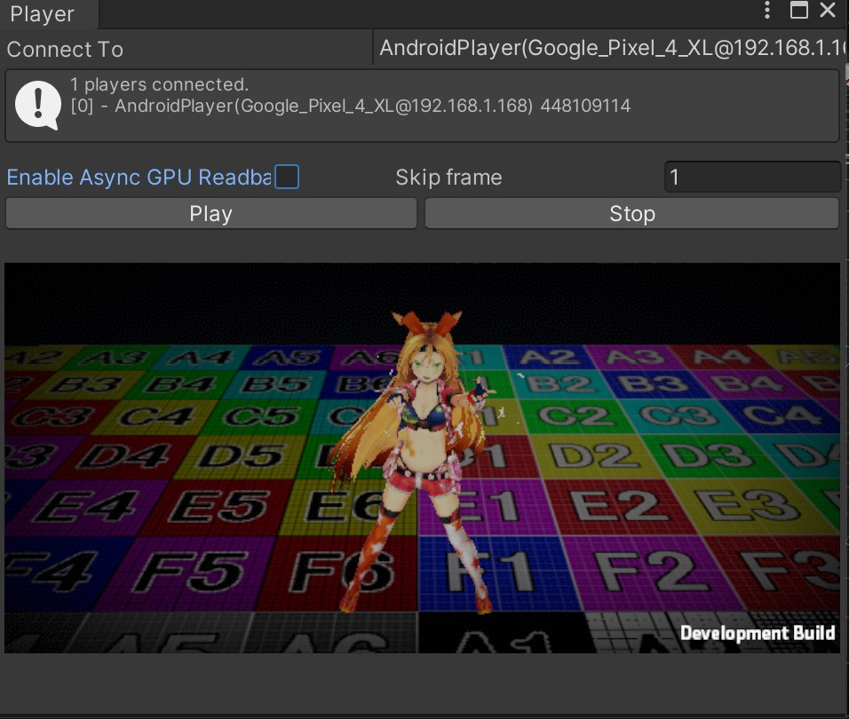
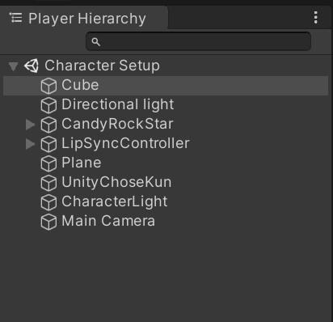
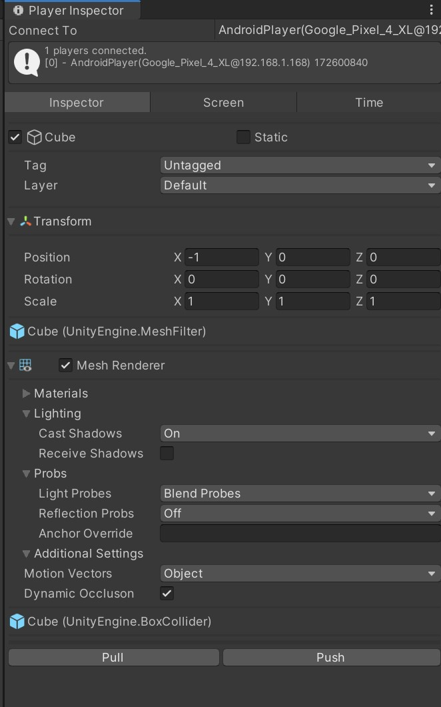
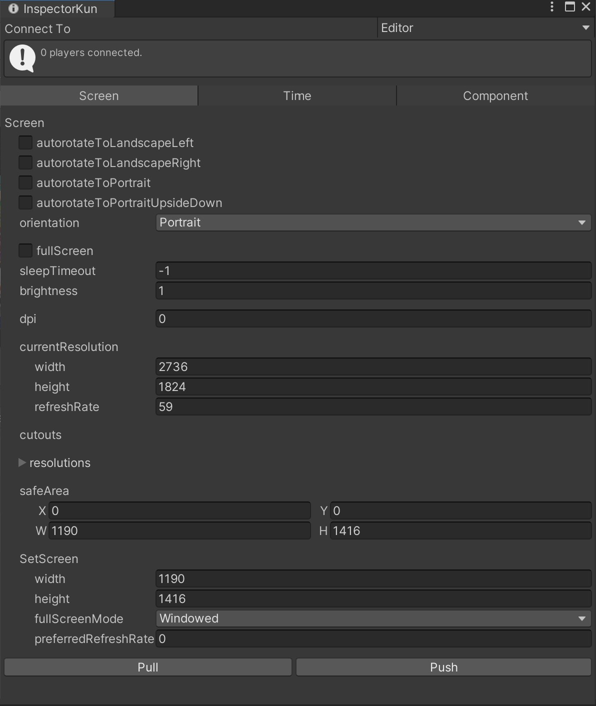
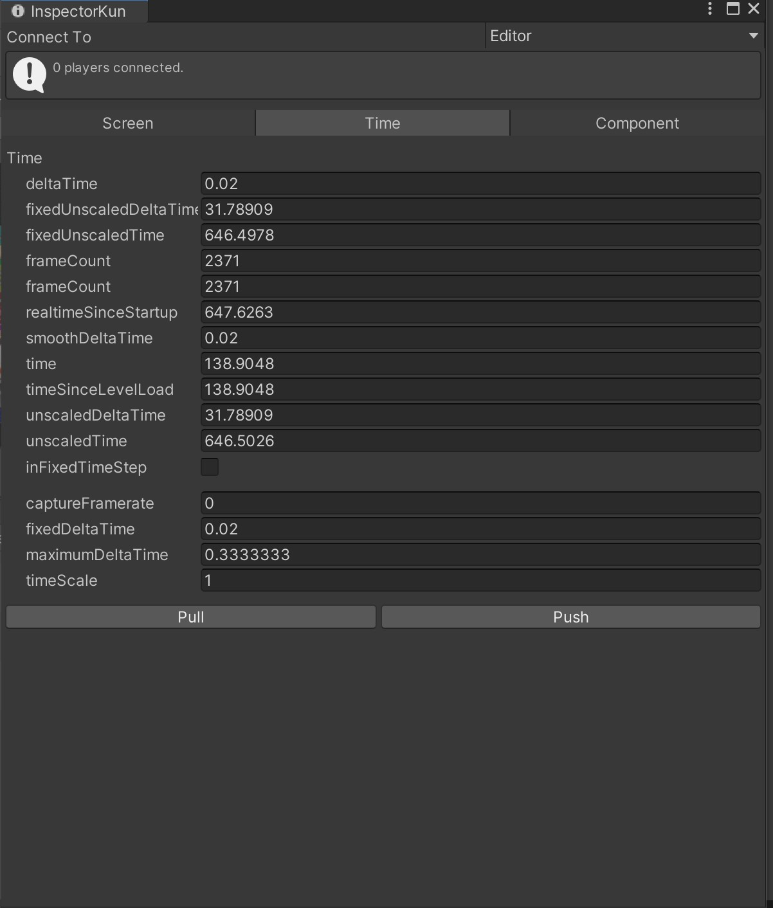

# UnityChoseKun
## Overview
This is a tool to adjust the applications built with Unity running on a real machine from Unity Editor.

## What you can do with this project
The following tasks can be performed in the UnityEditor
- Display the screen rendered on the device (PlayerView).
- Display hierarchy of the scene being played in the real device (Hierarchy View)
- Selects a GameObject from Hierarchy View and edits the content of the component to reflect it in the actual device (Inspector View).

## Operating Environment
Tested on following device and Unity version
- Unity2019.4.5f1
- Pixel3XL,Pixel4XL

## Adjustable Components
You can make adjustments on the following components
- [Screen](https://docs.unity3d.com/ScriptReference/Screen.html)
- [Time](https://docs.unity3d.com/ScriptReference/Time.html)
- Component
  - [Camera](https://docs.unity3d.com/ScriptReference/Camera.html)
  - [Light](https://docs.unity3d.com/ScriptReference/Light.html)
  - [Renderer](https://docs.unity3d.com/ScriptReference/Renderer.html)
  - [MeshRenderer](https://docs.unity3d.com/ScriptReference/Renderer.html)
  - [SkinnedMeshRenderer](https://docs.unity3d.com/ScriptReference/SkinnedMeshRenderer.html)
  - [MonoBehavior](https://docs.unity3d.com/ScriptReference/MonoBehaviour.html)
  - [Behavior](https://docs.unity3d.com/ScriptReference/Behaviour.html)
  - [Material](https://docs.unity3d.com/ScriptReference/Material.html)

## Notes
- Cannot be used with Script Debugging.
- When Player View is enabled, the device becomes __hot__. *
- Material is only for checking the content, not writing back the edited content.

## How to use
Place the entire contents of this repository under the Asset folder of UnityProject where you want to install.

### Building
- Put [UnityChoseKun](https://github.com/katsumasa/UnityChoseKun/blob/master/Player/Prefabs/UnityChoseKun.prefab) in a Scene and build the app.
- You must check [Development Build](https://docs.unity3d.com/ja/current/Manual/BuildSettingsStandalone.html) at build time.

### Executing
#### PlayerViewer
It is a viewer that plays back the content displayed on the real machine on UnityEditor.

From Menu, choose Window->UTJ->UnityChose-Kun->PlayerView.

###### Connect To
Specify the device you want to connect to. The connection mechanism is shared with UnityProfiler, so when you switch to one of them, the other one will switch to the other one as well.

###### Enable Async GPU Readback
If you check this box, you will be able to use [Async GPU Readback] (https://docs.unity3d.com/ja/2018.4/ScriptReference/Rendering.AsyncGPUReadback.html) to process images. This may reduce the load on MainTharead.

###### Skip frame
Specifies the interval for image transfer.

###### Play
Start the image transfer process.

###### Stop
Stops the image transfer process.

##### Warning

- This is a very high-load process.
- We recommend you to adjust the width and height in SetScreen or Skip Frame and then press the Play button.

#### PlayerHierarchy

Analyzes the Scene information of the application running on a real machine and expands it as a Hierarchy Tree.
To obtain and analyze the information, you need to run Inspector View->Inspector->Pull.

#### InspectorViewer
You can check and edit the contents of Screen, Time and GameObject Components(Camera, Light) of the applications running on the device.

###### How to launch

From Menu, choose Window->UTJ->UnityChose-Kun->Inspecter to launch it.

###### Connect To
Specify the device you want to connect to. The connection mechanism is shared with UnityProfiler, so when you switch from one device to the other, the other device will be switched as well.

###### Inspector/Time/Component
Toggle the classes displayed in the Inspecter View

#### Inspector View(Inspector)

Displays the information of the selected GameObject from the Hierarchy View.

###### Pull.
Analyzes the Scene information of an application running on a real device and expands it to Hierarchy View.

###### Push
Writes the contents of the selected GameObjects back to the actual device.

#### InspectorViewer(Screen)

Display and edit the Screen class.

###### Pull.
Obtain Screen Class content of an application running on a real device.

###### Push
Feed back the edited contents to the application running on the device.

##### InspectorViewer(Time)

###### Pull.
Obtain Time Class content of an application running on a real device.

###### Push.
The edited content is fed back to the application running on the actual device.
